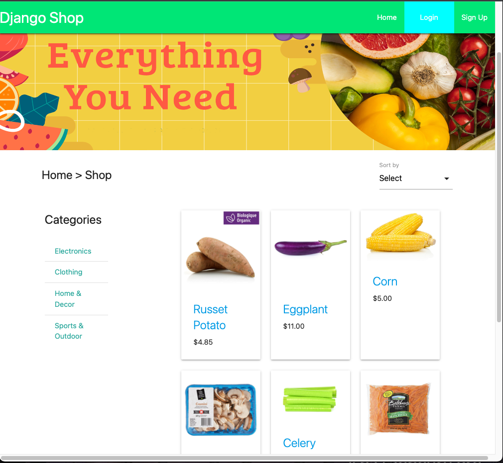
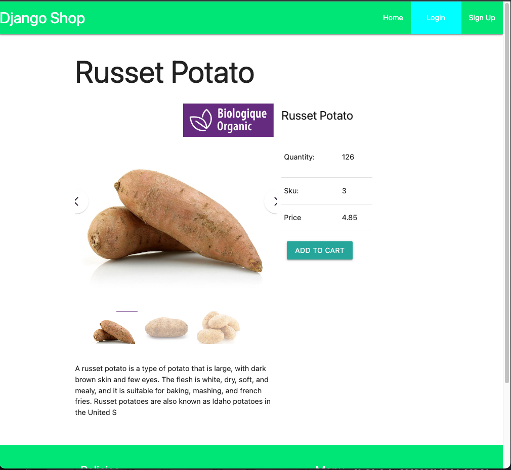
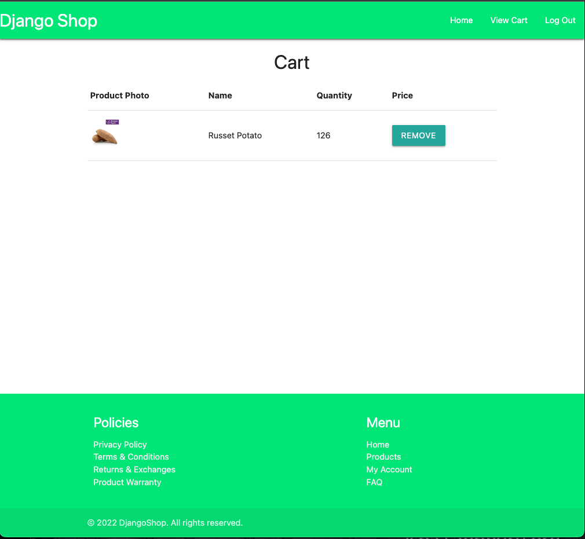

***Introduction*** 
___
The title of this web application is DjangoShop It was built with the intent to ideally help small grocery stores be able to handle orders online in order to bring in more revenue, as well as bringing more awareness to their existence by having an online presence.
***Technologies Used***
___
HTML, CSS, Django, Heroku, AWS S3Bucket, Python, PostgreSQL, Materialize framwork, Javascrip, fancyapps

***Getting Started ***
___
Link to application https://shop-sei.herokuapp.com/ 
 
### User 
Once a user is on the site, they will be able to view all products that exist within a store that was added to the application. But to be able to add to their cart, they will need to login or signup. A user will not be able to view what exist within their cart or be able to add to it, or remove from it without being logged in. Unlike the owner the user won't be able to add, edit, delete products or upload photos to a product. 
 
### Owner 
Once the owner lands on our site like any other user, they will be able to view all the products they have added, but won't be able to add, delete, edit products or upload photos to a product until they are logged in.  
Unlike a user, the logged in store owner does not have a cart page. 
(Store Owners Please contact developers of the APP to have your login credentials created for you, as you won't to create the owner side of the application be able to on the front end) 
Ideally any image added on the owner side of the site should be horizontal for aesthetic purposes. 
***Next Step***
___
In order for the users and owner to have a better experience using this web application, we plan on being able to order products by their category, letting users be able to choose the quantity of products they want, adding and viewing a subtotal of a user's selected products on their cart page, and letting user be able to reserve those products. 
On the owner's side of the application, we are going to make It so that once a user has added a product to their cart and reserved those products it will deduct from the total quantity of that product. We will also like to have the owner be able to see the cart of a user once the cart of products are reserved